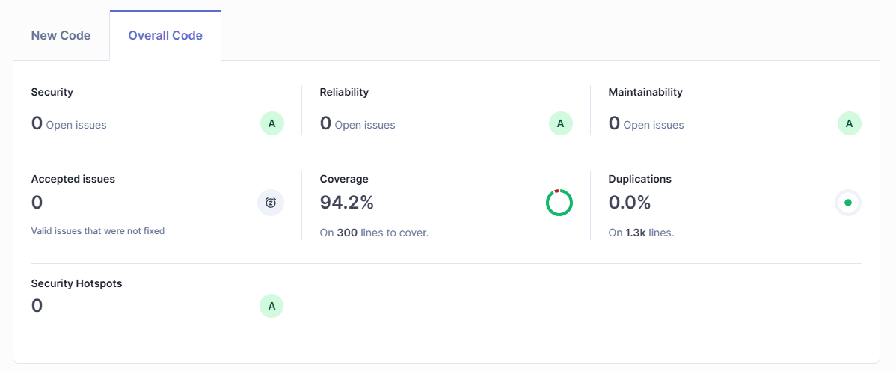
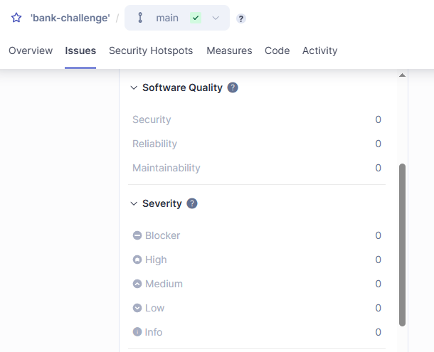
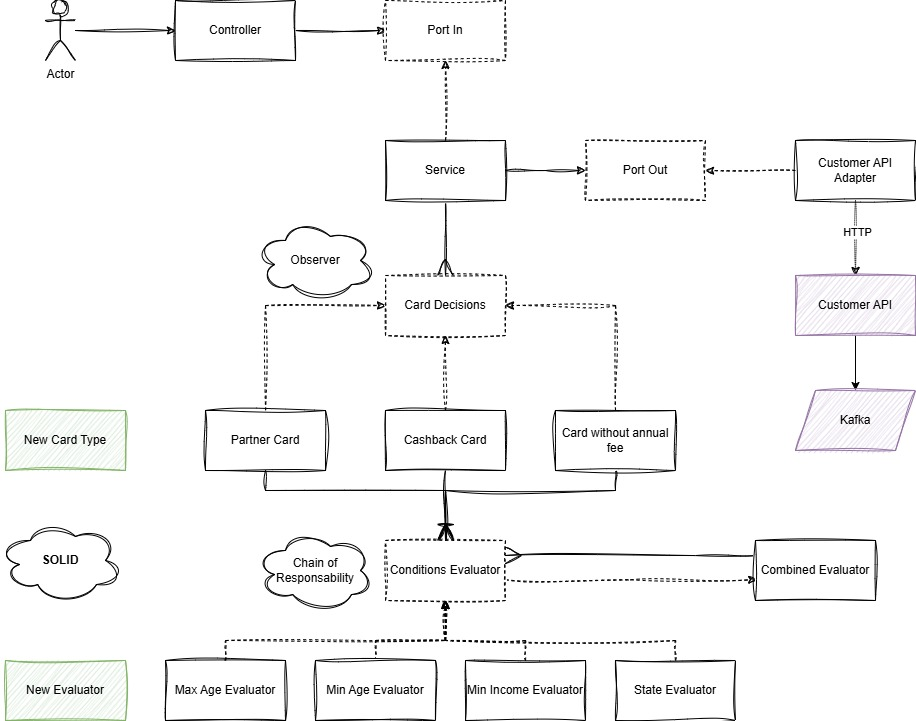

# Card Decision Service

## Overview
The **Card Decision Service** is a Spring Boot application designed to evaluate customer eligibility for various types
of credit cards based on specific conditions such as age, income, and state of residence.
The application uses a modular and extensible architecture to define and evaluate these conditions.

## Features
- **Card With Cashback**:
  - `cards.parameters.card-with-cashback.available-limit`**: Credit limit available for the cashback card.
  - `cards.parameters.card-with-cashback.min-income`: Minimum income required for eligibility.
  - `cards.parameters.card-with-cashback.min-age`: Minimum age required for eligibility.

- **Card Without Annual Fee**:
  - `cards.parameters.card-without-annual-fee.available-limit`: Credit limit available for the card without an annual fee.
  - `cards.parameters.card-without-annual-fee.min-income`: Minimum income required for eligibility.

- **Partner Card**:
  - `cards.parameters.partner-card.available-limit`: Credit limit available for the partner card.
  - `cards.parameters.partner-card.min-income`: Minimum income required for eligibility.
  - `cards.parameters.partner-card.min-age`: Minimum age required for eligibility.
  - `cards.parameters.partner-card.combination.allowed-states`: States where the card is allowed.
  - `cards.parameters.partner-card.combination.max-age`: Maximum age allowed for eligibility.

- **REST API**:
  - Maps customer requests to domain objects and provides responses with eligible cards or appropriate HTTP status codes.

## Technologies Used
- **Programming Language**: Kotlin
- **Framework**: Spring Boot
- **Messaging**: Kafka
- **Observability**: Phometheus and Grafana
- **Documentation**: Swagger
- **Build Tool**: Maven
- **Testing**: JUnit 5, Mockito

## How It Works
1. **Customer Request**: The application receives a customer request containing details like age, income, and state.
2. **Evaluation**: The request is processed through a series of evaluators to determine eligibility.
3. **Response**: A list of eligible cards is returned `200 OK`, or a `204 NO CONTENT` status is sent if no cards are available.

## Running the Application
1. Clone the repository.
2. Configure the application properties in `application.properties`.
3. Build and run the application using Maven:
   ```bash
   mvn spring-boot:run
    ```

## Running the Application Environment
1. Clone the repository.
2. Run the docker-compose file:
    ```bash
      docker-compose up --build --force-recreate
    ```
3. Call the main application on http://localhost:8089/cartoes:
    ```bash
      curl --request POST \
      --url http://localhost:8089/cartoes \
      --header 'Content-Type: application/json' \
      --data '{
      "cliente": {
        "nome": "Cliente Teste",
        "cpf": "77024795077",
        "idade": 31,
        "data_nascimento": "2000-01-01",
        "uf": "RJ",
        "renda_mensal": 5000,
        "email": "cliente@teste.com",
        "telefone_whatsapp": "11999992020"
      }
    }'
    ```

## Useful links:

- Redpanda: http://localhost:8090/topics/customer-information/
- Prometheus: http://localhost:9090/
- Grafana: http://localhost:3000/
- Swagger: http://localhost:8089/swagger-ui/index.html#/
- Kafka Broker: http://localhost:9092/
- Customer API: http://localhost:8082/
- Bank Challenge API: http://localhost:8089/

## Sonar Coverage:



## Sonar without issues:


## Solution Architecture Design:


## Design Patterns:
- Hexagonal Architeture: https://docs.aws.amazon.com/prescriptive-guidance/latest/cloud-design-patterns/hexagonal-architecture.html
- Abstract Factory: https://refactoring.guru/design-patterns/abstract-factory
- Chain of Responsibility :https://refactoring.guru/design-patterns/chain-of-responsibility
- Observer: https://refactoring.guru/design-patterns/observer